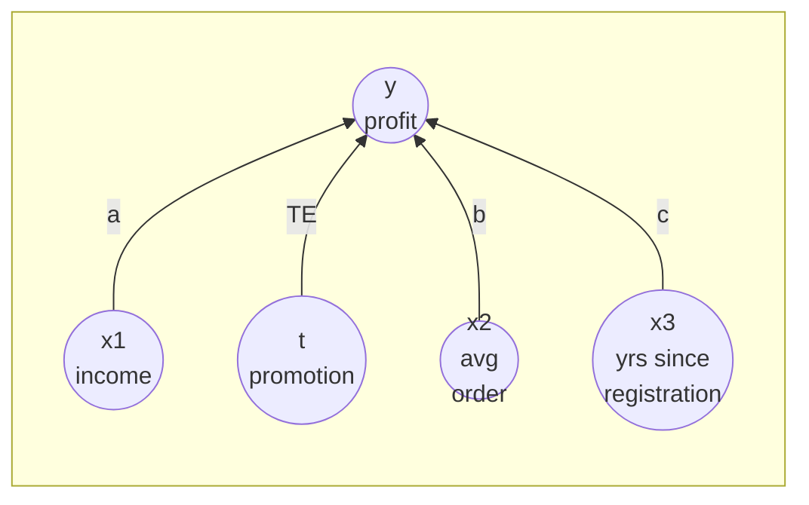

```mermaid
%%{init: {'theme':'default'}}%%

flowchart
subgraph  
direction BT
x1((x1 \n income))
x2((x2 \n avg \n order))
x3((x3 \n yrs since \n registration))
y((y \n profit))
t((t \n promotion))
x1 --a--> y
t --TE--> y
x2 --b--> y
x3 --c--> y
end
```