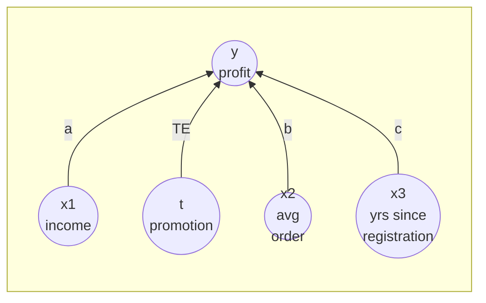
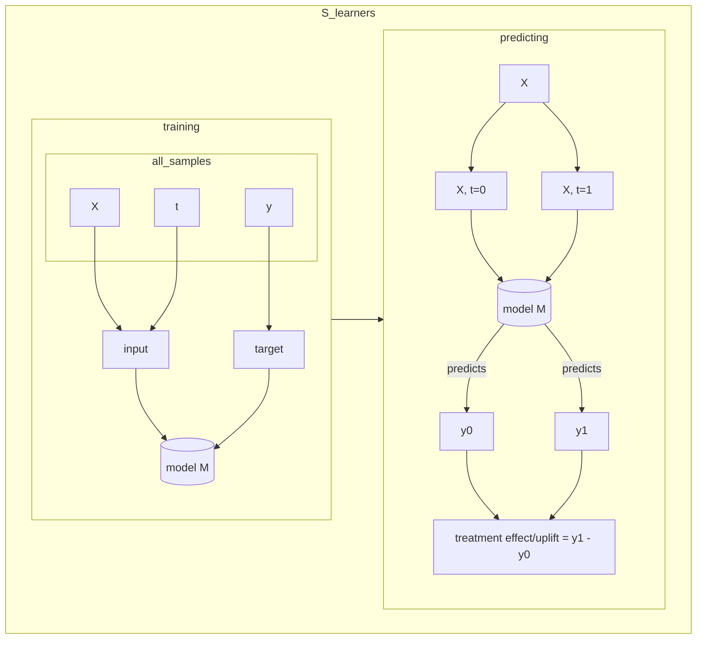
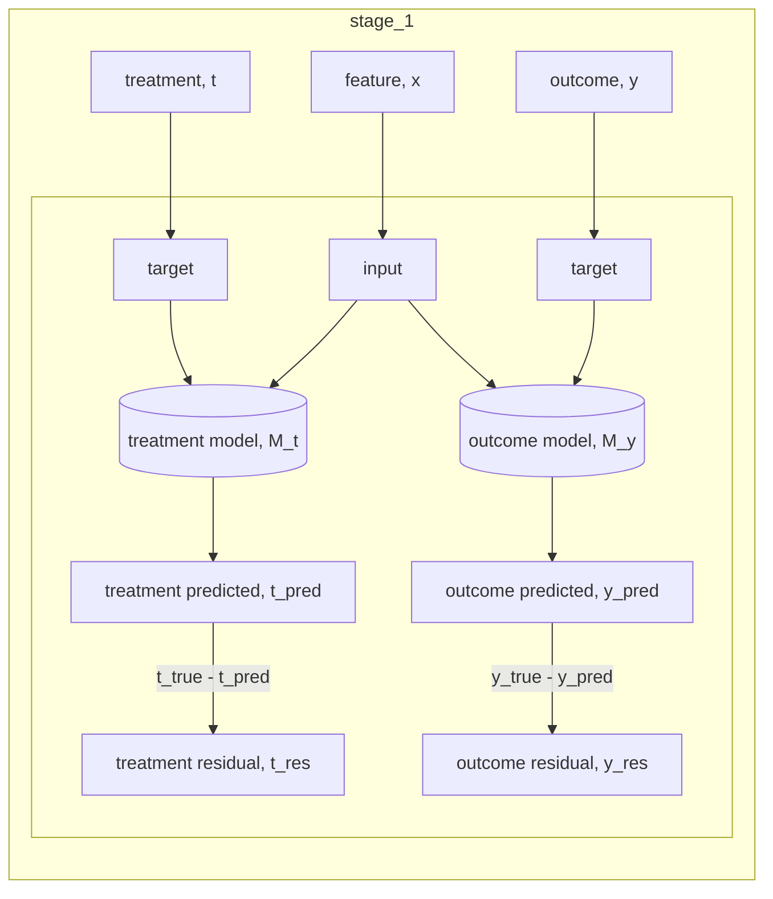
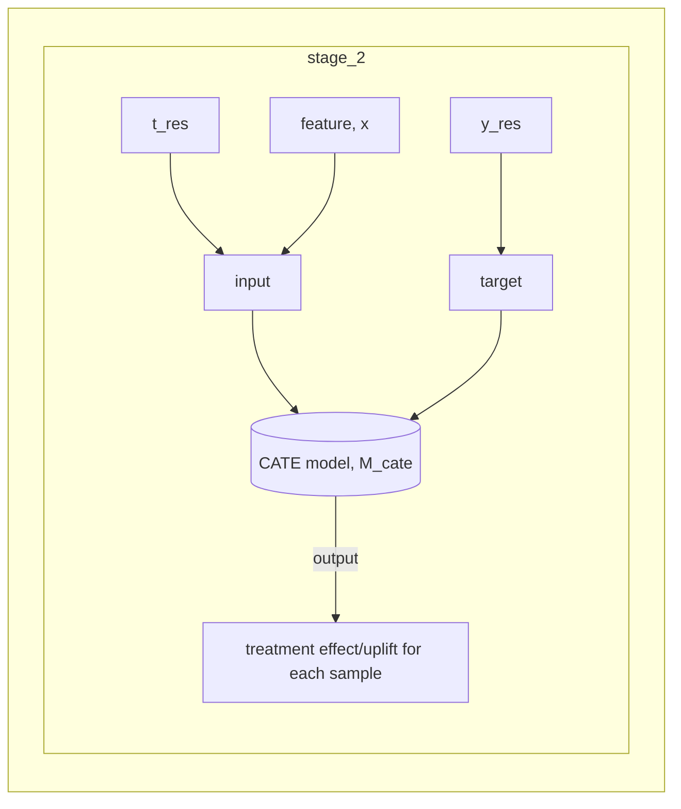

<!-- data generation process -->


<!-- slearner -->


<!-- tlearner -->
```mermaid
%%{init: {'theme':'default'}}%%
flowchart
subgraph T_learners
subgraph training
subgraph all_samples
X
t
y
end
subgraph control_samples,t=0
x_control[X]
y_control[y]
end

subgraph treated_samples,t=1
x_treatment[X]
y_treatment[y]

end
all_samples --> control_samples,t=0
all_samples --> treated_samples,t=1
m0[(control model M_0)]
m1[(treatment model M_1)]
input_train_control-->m0
input_train_treatment-->m1
target_train_control-->m0
target_train_treatment-->m1
input_train_control[input]
input_train_treatment[input]
target_train_control[target]
target_train_treatment[target]

x_control-->input_train_control
y_control-->target_train_control
x_treatment-->input_train_treatment
y_treatment-->target_train_treatment

end

subgraph predicting
input[X]
m0_pred[(control model M_0)]
m1_pred[(treatment model M_1)]
input --> m0_pred
input --> m1_pred
y0[y0]
y1[y1]
m0_pred --predicts-->y0
m1_pred --predicts-->y1
cate[treatment effect/uplift = y1 - y0]

y0-->cate
y1-->cate
end
training --> predicting
end
```

<!-- stage1 -->


<!-- stage2 -->

